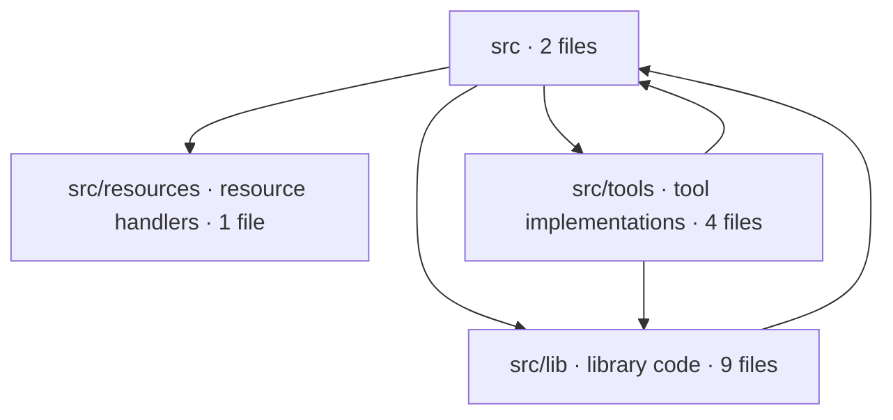

# repo-cartographer

> **Understand any codebase in 60 seconds.** An [MCP](https://modelcontextprotocol.io) server that turns any repository into an architecture diagram.

    [](https://github.com/builditwithgk/repo-cartographer/actions/workflows/architecture.yml)

Point your LLM at a folder and get back an architecture map: languages, frameworks, entry points, modules, and an import graph — rendered as a [Mermaid](https://mermaid.js.org/) diagram you can drop into a PR, a doc, or an onboarding guide.

It is **model-agnostic**. It speaks the Model Context Protocol over stdio, so it works with Claude Code, Claude Desktop, Cursor, Cline, Copilot, or the OpenAI Agents SDK — no Claude-specific dependency.

## Why it's different

**The server extracts hard facts. The model does the reasoning.**

`repo-cartographer` never tries to "understand" your code semantically. It parses deterministic facts — file tree, import edges, manifests, framework detection, entry points — and hands your LLM structured JSON plus a **draft** diagram. Your model turns those facts into the final narrative and a refined diagram.

That split keeps the server small, fast, testable, and portable — and it means the diagram is grounded in what's actually in the repo, not hallucinated.

## Example output

Running `generate_diagram` against **this repo** produces (a draft the model then refines):



A self-contained, shareable HTML render is committed under [`examples/`](examples/) (both a high-level and a file-level [`detail`](examples/repo-cartographer-detail.html) view).

## Install & run

Requires Node.js 18+.

```bash
# Run directly (no install)
npx -y repo-cartographer

# …or from source
git clone https://github.com/builditwithgk/repo-cartographer
cd repo-cartographer
npm install
npm run build
node dist/index.js
```

The server communicates over stdio; AI clients launch it that way. You can also use it directly from a terminal — see below.

## Command line (no AI needed)

The same binary is dual-mode: with no arguments it's the MCP server; with a subcommand it's a plain CLI for humans and CI.

```bash
# Draw a diagram — path in, architecture.html out
npx -y repo-cartographer map ./my-project
npx -y repo-cartographer map ./my-project --level detail -o docs/architecture
npx -y repo-cartographer map ./my-project --format dot   # Graphviz DOT instead of Mermaid

# Enforce architecture rules (exits 1 on an error-level violation — use it in CI)
npx -y repo-cartographer check ./my-project --config .cartographer.yml
```

Zip-friendly: if you point it at an extracted "Download ZIP" folder (`repo-main/` wrapper and all), it detects the wrapper and maps the real repo root — noted in the output, never silent.

Two output notations, one strategy: **Mermaid because that's where people read it** (GitHub renders it natively in PR comments and READMEs), **DOT because that's what their tools eat** (pipe it into Graphviz, Backstage, or anything else: `dot -Tsvg architecture.dot`). Both come with the same shareable HTML page and role-colored modules. When the repo has a `.cartographer.yml`, its `diagram:` section supplies the defaults for `--level`, `--format` and `-o`; explicit flags always win.

`check` reads a rules file and flags **forbidden cross-boundary imports** and **dependency cycles** — deterministically, no LLM involved, so it's safe to gate a merge:

```yaml
# .cartographer.yml
rules:
  forbidden:
    - from: "src/ui/**"
      to:   "src/db/**"
      reason: "UI must go through the service layer, not the DB directly."
  cycles: error        # error | warn | off
```

**Adopting on an existing codebase?** Record today's violations as an accepted baseline, so only *new* ones fail the build:

```bash
npx -y repo-cartographer check . --update-baseline   # writes .cartographer-baseline.json
```

Commit that file; later runs auto-detect it and pass unless a PR introduces a *new* violation.

## Architecture governance in CI (GitHub Action)

A composite action ([`action.yml`](action.yml)) runs `check` on every PR — failing the
build on an error-level violation and posting a sticky comment with the diagram and
any violations:

```yaml
# .github/workflows/architecture.yml
on: pull_request
permissions: { contents: read, pull-requests: write }
jobs:
  architecture:
    runs-on: ubuntu-latest
    steps:
      - uses: actions/checkout@v4
      - uses: builditwithgk/repo-cartographer@v1
        with: { path: ., config: .cartographer.yml }
```

This repo dogfoods it in [`.github/workflows/architecture.yml`](.github/workflows/architecture.yml).
Full design + phases: [docs/github-action.md](docs/github-action.md).

## Use it with Claude Code

```bash
claude mcp add repo-cartographer -- npx -y repo-cartographer
```

Then ask: *"Use repo-cartographer to map ./my-project and draw me an architecture diagram."*

### Claude Desktop

Add to `claude_desktop_config.json`:

```json
{
  "mcpServers": {
    "repo-cartographer": {
      "command": "npx",
      "args": ["-y", "repo-cartographer"]
    }
  }
}
```

## Use it with the OpenAI Agents SDK

Same server, a different model — the whole point of MCP:

```python
import asyncio
from agents import Agent, Runner
from agents.mcp import MCPServerStdio

async def main():
    async with MCPServerStdio(
        params={"command": "npx", "args": ["-y", "repo-cartographer"]},
    ) as cartographer:
        agent = Agent(
            name="Cartographer",
            instructions=(
                "Use the repo tools to gather facts, then refine the draft "
                "Mermaid diagram into a clean architecture map."
            ),
            mcp_servers=[cartographer],
        )
        result = await Runner.run(agent, "Map ./my-project and explain its architecture.")
        print(result.final_output)

asyncio.run(main())
```

## Tools & resources

| Tool | What it returns |
| --- | --- |
| **`map_repo(path, level?, format?, outPath?)`** | **The one-shot flow.** Point it at a folder and get a downloadable architecture diagram (`architecture.html` + `.mermaid`/`.dot`) plus a facts summary and the draft source inline — in a single call. |
| `scan_repo(path)` | Languages, frameworks, entry points, top-level modules (with role guesses), and a manifest summary — as JSON facts. |
| `build_import_graph(path)` | Intra-repo import/require edges for JS/TS + Python. Nodes are files, auto-collapsed to module level for large repos. |
| `generate_diagram(path, level?, format?)` | A **draft** diagram. `level` = `"high"` (modules, default) or `"detail"` (files grouped by module); `format` = `"mermaid"` (default) or `"dot"` (Graphviz). |
| `render_diagram(source, outPath, format?)` | Writes a self-contained, styled `.html` (renders via CDN: Mermaid, or Viz for DOT) plus the raw `.mermaid`/`.dot` file. |

| Resource | |
| --- | --- |
| `about://author` | Who built this and how to reach them (Markdown). |

**Most of the time you just want `map_repo`** — "path in, diagram out." Reach for the four granular tools only when you want to compose the steps yourself (e.g. let the model refine the diagram source between `generate_diagram` and `render_diagram`).

## How it stays fast on big repos

- **Languages:** JavaScript/TypeScript and Python (v1).
- **Skips** `node_modules`, `.git`, `dist`, `build`, `venv`, `__pycache__`, `vendor`, and other build/dependency/cache directories (plus all hidden dirs).
- **Caps** the number of files scanned and bytes read per file; **collapses** the import graph to directory level past a threshold. Anything capped is reported in the output — never dropped silently.
- **No network calls** at scan time. (The rendered HTML pulls Mermaid from a CDN only when *you* open it in a browser.)
- **Deterministic:** output is sorted and stable, so diagrams don't churn between runs.

## Development

```bash
npm run dev        # run from source with tsx
npm run build      # type-check + emit to dist/
npm test           # unit tests (node:test, no build step needed)
npm run typecheck  # type-check src/ and test/ together, no emit
```

Tests cover the deterministic core — import resolution (JS/TS + Python), module
collapsing, cycle detection, rule globs, baseline diffing, Mermaid rendering and
the `check` end-to-end path. They run against `src/` via `tsx`, so there is no
build step and no test framework dependency.

## Author

Built by **Gopi K Aitham** ([builditwithgk](https://github.com/builditwithgk)) — see `about://author`, or [scaleup-solutions.in](https://scaleup-solutions.in/). Available for freelance and contract work on AI, agent, and MCP tooling.

## License

MIT
